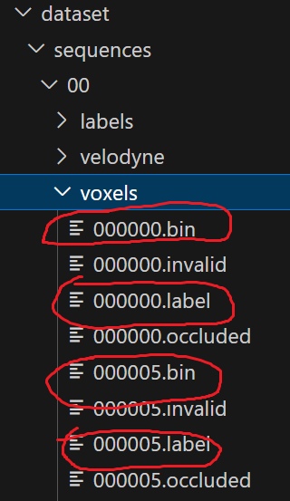
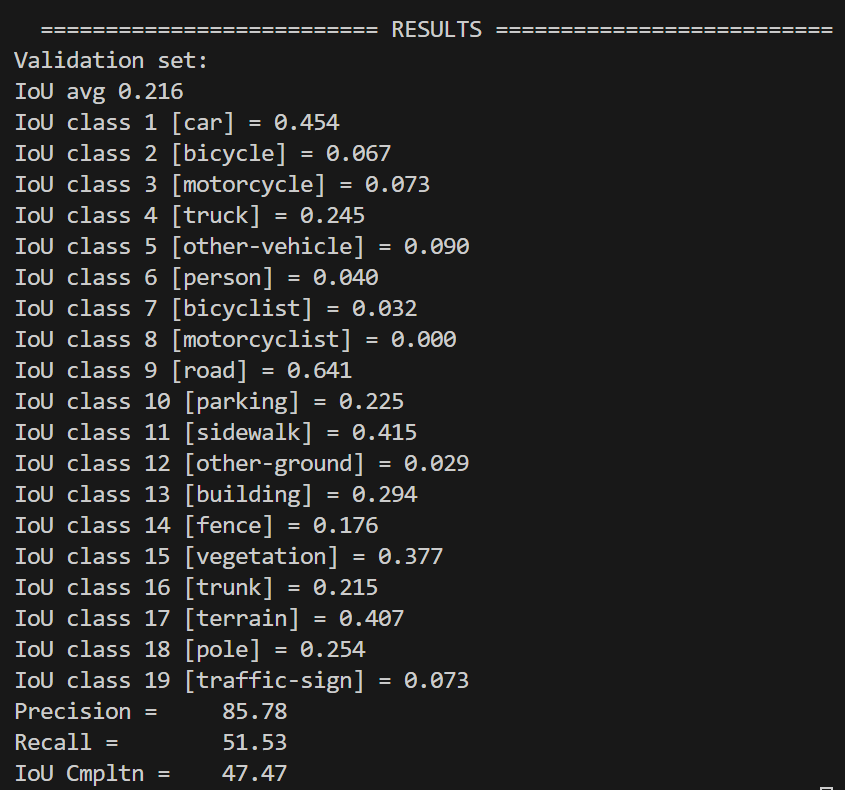

# SCPNet
This repo is based on the official SCPNet code.

## 0. Purpose of this Repository
The official SCPNet code is out of date. So when you try following their description of installing the envrionment, you will run into endless errors. So I decided to write a new repo that helps you run the official SCPNet code :D 

## 1. Environment Setup Guide (Works as of 2024-04-02)
- python==3.7 ✅
    - conda create -n SCPNet_MF python=3.7
    - conda activate SCPNet_MF
    - conda config --set ssl_verify false
- torch 1.10.0, cuda==11.3 (if you get a Conda HTTP error, keep on reinstalling until it finishes. There is no possible solution for this as this is a network issue) ✅
    - conda install -y pytorch==1.10.0 torchvision==0.11.0 cudatoolkit=11.3 -c pytorch -c conda-forge
    - conda install -y cudatoolkit-dev=11.3 -c conda-forge (this process can take long, please be patient)
- check if CUDA is available ✅
    - CUDA_VISIBLE_DEVICES=1 python grogu.py
- pyyaml ✅
    - conda install -y anaconda::pyyaml
- Cython ✅
    - conda install -y anaconda::cython
- tqdm ✅
    - conda install -y anaconda::tqdm
- numba ✅
    - conda install -y anaconda::numba
- Numpy-indexed ✅
    - conda install -y conda-forge::numpy-indexed
- torch-scatter ✅
    - conda install -y pytorch-scatter -c pyg
- spconv==1.0 ✅
    - git clone https://github.com/tyjiang1997/spconv1.0.git --recursive
    - sudo apt-get install libboost-all-dev
    - conda install -y anaconda::cmake
    - conda install -y anaconda::cudnn
    - CUDA_VISIBLE_DEVICES=1 python setup.py bdist_wheel
        - if you ecounter any type of issues, try following the 2 steps below
            - 1. broken nvcc problem
                - then, open CMakeLists.txt add the following lines in between line 1 and 2
                    - set(CMAKE_CUDA_COMPILER "/home/user/anaconda3/envs/REPLACE_THIS_WITH_THE_NAME_OF_UR_CONDA_ENVIRONMENT/bin/nvcc")
                    - set(CUDA_TOOLKIT_ROOT_DIR "/home/user/anaconda3/envs/REPLACE_THIS_WITH_THE_NAME_OF_UR_CONDA_ENVIRONMENT")
            - 2. no matching function for call to 'torch::jit::RegisterOperators::RegisterOperators'
                - then, go to spconv/src/spconv/all.cc
                - use "torch::RegisterOperators()" instead of "torch::jit::RegisterOperator()"
    - cd ./dist
    - pip install CHANGE_THIS_TO_THE_NAME_OF_THE_WHEEL_FILE
- check if spconv==1.0 is installed properly ✅
    - conda list
- strictyaml ✅
    - pip install strictyaml
- tensorboard ✅
    - conda install -y tensorboard

## 2. Dataset Preparation
### 2.1. Single Frame SCPNet
- Follow the KITTI dataset official guide
- You need the xxxxxx.bin and xxxxxx.label files inside the voxels directory the for semantic scene completion task
- You will have 4649 data for training and validation  

### 2.2. Multi Frame SCPNet
If you want to train SCPNet with fused multi frame semantic KITTI, I recommend you go [HERE](https://github.com/parkie0517/SemanticKITTI-MultiFrameGeneration).

## 3. Training
- open './config/semantickitti-multiscan' file
    - change the datapath to the correct location of your dataset
    - save and exit
- open './train_scpnet_comp.py'
    - go down to the very end
    - change the location where the tensorboard logs will be written
    - save and exit
- run the code below to train the SCPNet model
    - python train_scpnet_comp.py
    - CUDA_VISIBLE_DEVICES=1 python train_scpnet_comp.py

## 4. Evaluation
- output predictions by running the code below
    - test_scpnet_comp.py
- clone the semantic-KITTI api in a different directory
    - git clone https://github.com/PRBonn/semantic-kitti-api
- change directory to the cloned directory
    - cd PATH_TO_THE_CLONED_DIRECTORY
- run the code below
    - python evaluate_completion.py --dataset LOCATION_OF_THE_ORIGINAL_KITTIE_DATASET --predictions LOCATION_OF_THE_PREDICTIONS --split valid

### 4.1. Single Frame SCPNet 
- the image below is the result that I got

### 4.2. Multi Frame SCPNet
- To be constructed!

## 5. Visualization
- You need a display connected to the server to see the visualization results
- If you do not have a display connected to the server, then try visualizing the point cloud in your local computer
- please follow [4. Evaluation] to clone the semantic-KITTI api before visualizing the point cloud
- then, run the following code to visualzie the point cloud
    - python visualize.py --sequence 00 --dataset /mnt/ssd2/jihun/dataset/sequences/00
- if you want to visualize the voxel data then run the following code
    - python visualize_voxels.py --sequence 00 --dataset /c/Users/Juni/desktop/scpnet/dataset/
- if you run into no module found error, then install the necessary packages

## 6. Things I Was Curiousd About
- How does SCPNet address the problem of information loss in the segmentation sub-network?
    - By using an MPB (multi-path block) instead of pooling operations.
    - MPB is composed of 3D convolution operations.
