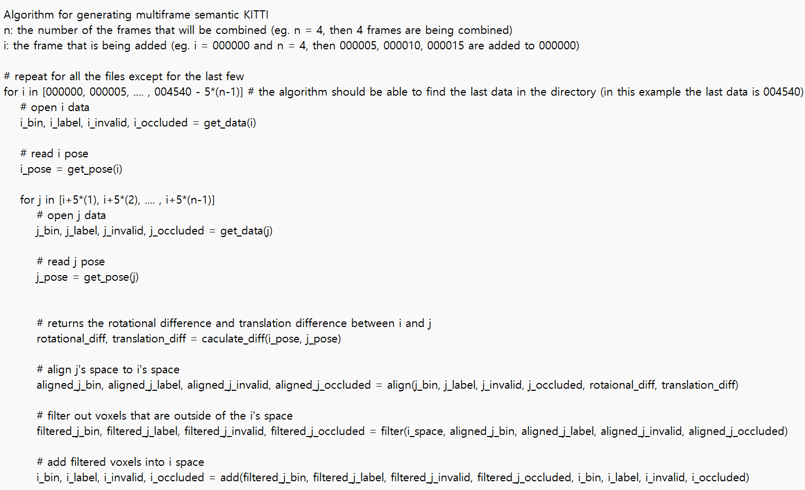

# SCPNet
This repo is based on the official SCPNet code.

## 1. Environment Setup Guide (Works as of 2024-04-02)
- python==3.7
    - conda create -n SCPNet python=3.7
    - conda activate SCPNet
    - conda config --set ssl_verify false
- torch 1.10.0, cuda==11.3 (if you get a Conda HTTP error, keep on reinstalling until it finishes. There is no possible solution for this as this is a network issue)
    - conda install -y pytorch==1.10.0 torchvision==0.11.0 cudatoolkit=11.3 -c pytorch -c conda-forge ✅
    - conda install -y cudatoolkit-dev=11.3 -c conda-forge (this process can take long) ✅
- check if CUDA is available
    - CUDA_VISIBLE_DEVICES=1 python grogu.py ✅
- pyyaml
    - conda install -y anaconda::pyyaml ✅
- Cython
    - conda install -y anaconda::cython ✅
- tqdm
    - conda install -y anaconda::tqdm ✅
- numba
    - conda install -y anaconda::numba ✅
- Numpy-indexed
    - conda install -y conda-forge::numpy-indexed ✅
- torch-scatter
    - conda install -y pytorch-scatter -c pyg
- spconv==1.0
    - git clone https://github.com/tyjiang1997/spconv1.0.git --recursive
    - sudo apt-get install libboost-all-dev
    - conda install -y anaconda::cmake
    - conda install -y anaconda::cudnn
    - CUDA_VISIBLE_DEVICES=1 python setup.py bdist_wheel
        - below are the two possible erros that you might encounter
            - 1. broken nvcc
                - then, open CMakeLists.txt add the following lines in between line 1 and 2
                    - set(CMAKE_CUDA_COMPILER "/home/user/anaconda3/envs/REPLACE_THIS_WITH_THE_NAME_OF_UR_CONDA_ENVIRONMENT/bin/nvcc")
                    - set(CUDA_TOOLKIT_ROOT_DIR "/home/user/anaconda3/envs/REPLACE_THIS_WITH_THE_NAME_OF_UR_CONDA_ENVIRONMENT")
            - 2. no matching function for call to 'torch::jit::RegisterOperators::RegisterOperators'
                - then, go to spconv/src/spconv/all.cc
                - use "torch::RegisterOperators()" instead of "torch::jit::RegisterOperator()"
            - 3. compiler requires the cuda toolkit
                - conda install -y conda-forge::cudatoolkit-dev
    - cd ./dist
    - pip install CHANGE_THIS_TO_THE_NAME_OF_THE_WHEEL_FILE
- check if spconv==1.0 is installed properly
    - conda list
- strictyaml
    - pip install strictyaml
- check if strictyaml is installed properly
    - conda list

## 2. Dataset Preparation
- Follow the KITTI dataset official guide

## 3. Training
- run the code below to train the SCPNet model
    - python train_scpnet_comp.py
    - CUDA_VISIBLE_DEVICES=1 python train_scpnet_comp.py

## 4. Evaluation
- output predictions by running the code below
    - test_scpnet_comp.py
- clone the semantic-KITTI api in a different directory
    - git clone https://github.com/PRBonn/semantic-kitti-api
- change directory to the cloned directory
    - cd PATH_TO_THE_CLONED_DIRECTORY
- run the code below
    - python evaluate_completion.py --dataset LOCATION_OF_THE_ORIGINAL_KITTIE_DATASET --predictions LOCATION_OF_THE_PREDICTIONS --split valid
- the image below is the result that I got

## 5. Visualization
- please follow [4. Evaluation] to clone the semantic-KITTI api before visualizing the point cloud
- install the following packages
    - conda install -y vispy
    - conda install -y matplotlib
- then, run the following code to visualzie the point cloud
    - python visualize.py --sequence 00 --dataset /mnt/ssd2/jihun/dataset/sequences/00

## 6. Generate Multi-frame Point Cloud
- please follow [4. Evaluation] to clone the semantic-KITTI api before generating the multi-frame point cloud
- then run this code
    - python generate_sequential.py --dataset PATH_TO_KITTI --sequence_length NUMBER_OF_N --output OUTPUT_PATH
    - CUDA_VISIBLE_DEVICES=1 python generate_sequential.py --dataset /mnt/ssd2/jihun/dataset --sequence_length 4 --output /mnt/ssd2/jihun/dataset/multiframe/length_4

## 6. Things I Was Curiousd About
- How does SCPNet address the problem of information loss in the segmentation sub-network?
    - By using an MPB (multi-path block) instead of pooling operations.
    - MPB is composed of 3D convolution operations.
